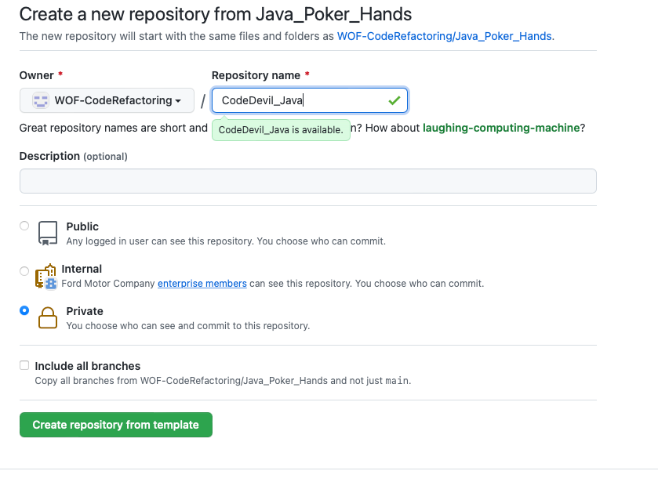
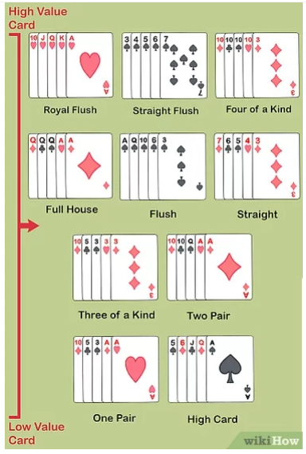

## How to Submit
* Create a repo(private) using this repo as template in this organization itself
  * repo name should be your Team/nick name followed by Language you choose ex: CodeDevil_Java
* Complete the refactorings and commit your code on the new repo created by you

## Poker Hands

A poker deck contains 52 cards - each card has a suit which is one of clubs, diamonds, hearts, or spades (denoted C, D, H, and S in the input data).

Each card also has a value which is one of 2, 3, 4, 5, 6, 7, 8, 9, 10, jack, queen, king, ace (denoted 2, 3, 4, 5, 6, 7, 8, 9, T, J, Q, K, A).

For scoring purposes, the suits are unordered while the values are ordered as given above, with 2 being the lowest and ace the highest value.

A poker hand consists of 5 cards dealt from the deck. Poker hands are ranked by the following partial order from lowest to highest.

#### Straight flush:
5 cards of the same suit with consecutive values. Ranked by the highest card in the hand.

#### Four of a kind:
4 cards with the same value. Ranked by the value of the 4 cards.

#### Full House:
3 cards of the same value, with the remaining 2 cards forming a pair. Ranked by the value of the 3 cards.

#### Flush:
Hand contains 5 cards of the same suit. Hands which are both flushes are ranked using the rules for High Card.

#### Straight:
Hand contains 5 cards with consecutive values. Hands which both contain a straight are ranked by their highest card.

#### Three of a Kind:
Three of the cards in the hand have the same value. Hands which both contain three of a kind are ranked by the value of the 3 cards.

#### Two Pairs:
The hand contains 2 different pairs. Hands which both contain 2 pairs are ranked by the value of their highest pair. Hands with the same highest pair are ranked by the value of their other pair. If these values are the same the hands are ranked by the value of the remaining card.

#### Pair:
2 of the 5 cards in the hand have the same value. Hands which both contain a pair are ranked by the value of the cards forming the pair. If these values are the same, the hands are ranked by the values of the cards not forming the pair, in decreasing order.

#### High Card:
Hands which do not fit any higher category are ranked by the value of their highest card. If the highest cards have the same value, the hands are ranked by the next highest, and so on.

### Note:
if two people face off with the same type of hand, the hand with tthe higer-ranking cards wins.If the hands have the exact ranks of cards (suit dies not matter), it is a tie

### Examples:

Input: Jack: 2H 3D 5S 9C KD John: 2C 3H 4S 8C AH \
Output: White wins - high card: Ace

Input: Jack: 2H 4S 4C 2D 4H John: 2S 8S AS QS 3S \
Output: Jack wins - full house

Input: Jack: 2H 3D 5S 9C KD John: 2C 3H 4S 8C KH \
Output: Jack wins - high card: 9

Input: Jack: 2H 3D 5S 9C KD John: 2D 3H 5C 9S KH \ 
Output: Tie

### Refactoring Opportunities
* There are many duplicated fragments available across the code. 
* Methods are too long and not easily understandable
* No functional way of programming
* Conditional and cognitive complexities are high
*Not adequate test cases

### Scope for improvements
* Currently the application will compares the two players cards, you can make that to compare 5 players card ( A Desk) and sort them based on the high value ( extra 3 points)
* Current application doesn't support bid and fold systems => Every player can place the bids and there will be rounds.. in each round the players can increase their bid. The players can also folds their in between their rounds, if they folds their card they will be considered out of the session and their bidded amount will be given to winner. No. of rounds will be decided by the player and winner will get all the bid money. (extra 7 points)

# Happy Refactoring !!!
